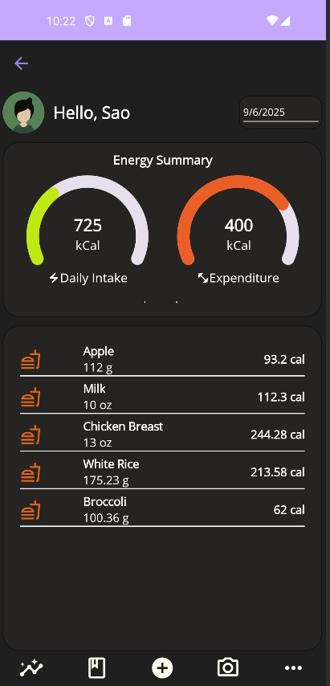

# SmartBite
Your smart companion for effortless food tracking.

## Description
SmartBite is a food tracking app designed to help you monitor your nutritional intake with ease. Whether you're at the grocery store or cooking a meal at home, the app provides flexible options for logging food, including lightning-fast barcode scanning and a comprehensive manual entry system for new or custom food items.

## Features
**Barcode Scanning:** Quickly add food items by scanning their barcode.

**Manual Tracking:** Log food manually with detailed nutritional information.

**Custom Food Entry:** Add and save your own unique food items for future use.

**Nutritional Insights:** View a summary of your macronutrients and calorie intake.

## Getting Started
Follow these steps to set up and run the project locally.

### Prerequisites
**.NET 8.0 SDK:** The latest version of the .NET SDK.

**Visual Studio 2022:** With the .NET Multi-platform App UI development workload installed.

**[Syncfusion License](https://www.syncfusion.com/):** A valid license key is required to use Syncfusion components. You can obtain a free community license if you meet the eligibility criteria. 

### Clone the Repository
```
git clone https://github.com/your-username/smartbite.git
```
Build and Run
Open the SmartBite.sln solution file in Visual Studio.

Set your desired target platform (e.g., Android, iOS, Windows) from the dropdown menu and run the application.

## Main Page Screenshot
---

<div align="center">
  
</div>

---
